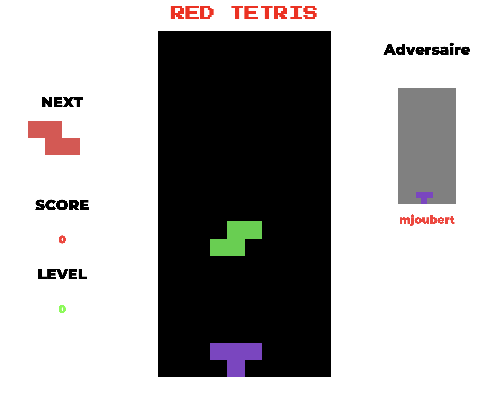

## RED TETRIS BOILERPLATE - PROJECT 42

This starter kit was made to help students to develop red_tetris project : a Full Stack Javascript Tetris. We can also use it as a starting point for any product made of React / Redux and socket.io.

### `General instruction`

The goal of this project is to develop a multiplayer tetris game on the network with a set of software exclusively from Full Stack Javascript.

For play in multiplayer please add hash-bashed url type :
http://<server_name_or_ip>:<port>/#<room>[<player_name>]

Front-end has been developed using latest features from ReactJS. State is managed using React Hooks except for sockets for which Redux has been used. Front-end communicates with socket server to handle tetris games.

Back-end has been developed using NodeJS and Express.

Socket server has been developed using NodeJS, Express and SocketIO.

### `Skills`

<ul>
  <li>
    Object-oriented programming
  </li>
  <li>
    Web
  </li>
  <li>
    Functional programming
  </li>
  <li>
    Technology integration
   </li>
</ul>     

## Preview

I created the whole structure of the game in front in hooks with files :

<ul>
  <li>
    useGameStatus manage the score, delete lines and points
  </li>
  <li>
    useInterval for automatic movement of parts
  </li>
  <li>
    usePlayer is hook with a state of tetriminos play, with sharpe, position and collided or not. usePlayerPreview is a use for multiplayer display.
  </li>
  <li>
    usePrevious is a hook for save the previous data.
   </li>
    <li>
    useStage is a hook for for the game board. useStagePreview is use for multiplayer display.
   </li>
</ul> 

I used redux and created a middleware to emit the datas for socket.

## Development Mode

Install:

`npm install`

### `Launch Server`

`npm srv, if i don't have install nodemon globally please add this in place "nodemon" : node_modules/.bin/nodemon`

### `Launch Client`

`npm start`

### `Test`

Please stop server before and 
`npm run test`
All the tests are in the test files folders
`npm run coverage`
